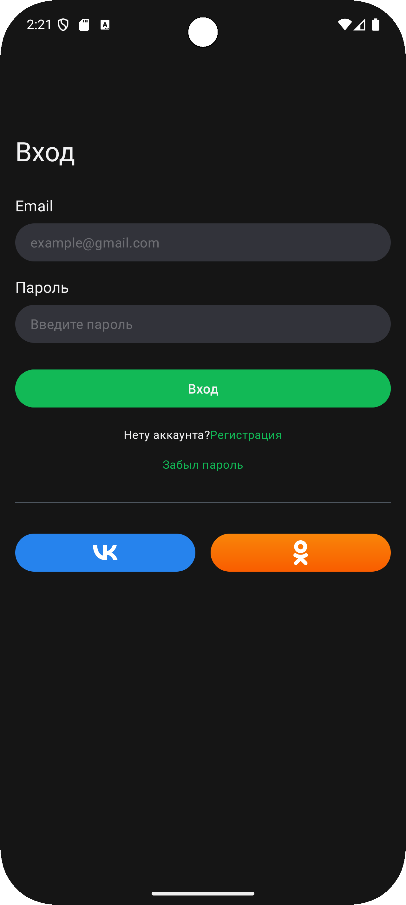

# 🎓 Android — приложение для поиска онлайн-курсов
## 📱 Интерфейс приложения

  
   
  <em>Рис. 1: Экран входа в приложение</em>

Кнопка "Войти" становится доступна только если:
- email заполнен по маске "текст/цифры@текст.текст" и не пустой
- пароль не пустой
