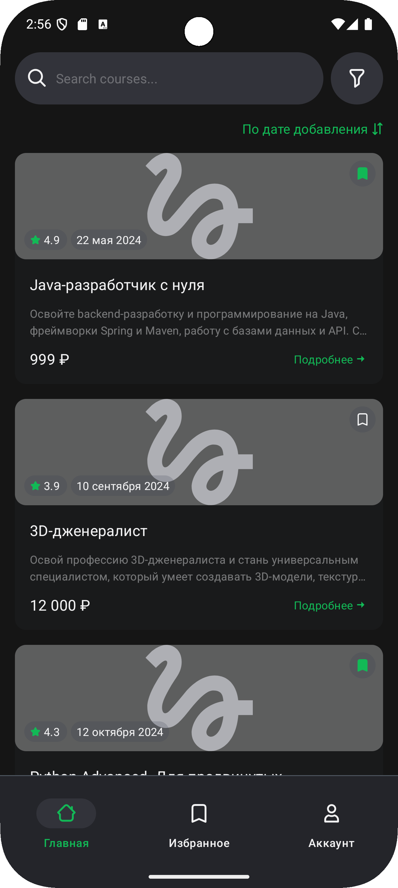
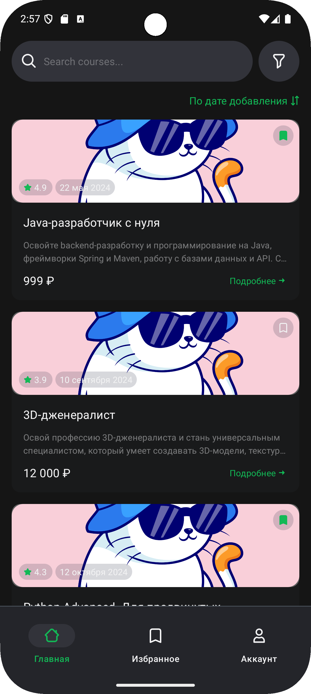
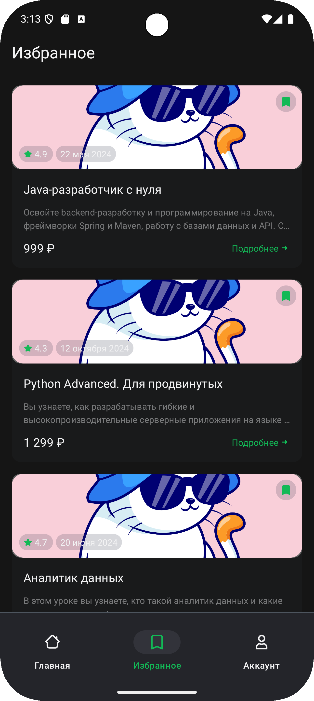

# 🎓 Android — приложение для поиска онлайн-курсов
## 📱 Интерфейс приложения

  
   
  <em>Рис. 1: Экран входа в приложение</em>

✨ Возможности:
- Кнопка "Войти" становится доступна только если:
    - email заполнен по маске "текст/цифры@текст.текст" и не пустой
    - пароль не пустой
- По клику на кнопки социальных сетей (Vk/Одноклассники) осуществляется переход на эти социальные сети 

  
  
   
  <em>Рис. 2: Главный экран</em>

✨ Возможности:
- Если логотип курса не получен, пользователь видит плейсхолдер
- Сортировка курсов по дате добавления в порядке уменьшения
- Добавлять и удалять курс из "Избранное"

  
   
  <em>Рис. 3: Экран "Избранное"</em>

✨ Возможности:
- Добавлять и удалять курс из "Избранное"

## 🛠 Технологии
- Kotlin + Coroutines
- Retrofit для API
- Room 
- Flow и LiveData
- Koin
- MVVM
- AdapterDelegates
- Clean Architecture
